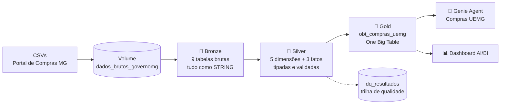

# 🏛️ Compras UEMG: Engenharia de Dados no Databricks

Pipeline de dados ponta a ponta, construído com **arquitetura Medallion no Databricks**, para analisar **17 anos de compras públicas da Universidade do Estado de Minas Gerais (UEMG)** a partir dos dados abertos do Portal de Compras do Estado de Minas Gerais.

> Projeto de estudo desenvolvido para fixar o aprendizado da **Imersão Alura em Engenharia de Dados**, com os professores **Agnes Ruecas**, **Lucas Ribeiro Mata** e **Oscar Guillermo Richieri Meye**.


---

## 📌 Resumo

| | |
|---|---|
| **Registros processados** | 2,1 milhões de itens de compra (Estado inteiro, 2009–2025) |
| **Tabelas de origem** | 9 arquivos CSV (3 fatos + 6 dimensões) |
| **Recorte analítico** | 13.542 itens homologados da UEMG |
| **Valor analisado** | R$ 653,9 milhões homologados em 1.861 processos |
| **Fornecedores** | 980 |
| **Plataforma** | Databricks Free Edition (Unity Catalog, Serverless, Genie, AI/BI Dashboards) |

---

## 🏗️ Arquitetura



Tudo fica no catálogo `uemg_compras` do Unity Catalog, com os schemas `bronze`, `silver` e `gold`.

### 🥉 Bronze: ingestão fiel à origem
- Um Volume com **uma subpasta por tabela**, o que permite novas cargas sem alterar código.
- Todas as colunas são lidas como `STRING` para não perder informação (ex.: CNPJs com zeros à esquerda).
- Tratamento de BOM, CRLF e campos com `;` entre aspas.
- Colunas técnicas de auditoria: `_arquivo_origem`, `_dt_modificacao_arquivo`, `_dt_ingestao`.

### 🥈 Silver: tipagem, limpeza e regras de qualidade
- **Dimensões:** órgão (com flag de inativo), município (com `tipo_localidade` derivado do código IBGE), material/serviço, item e fornecedor (CNPJ corrigido com `lpad`, `cnpj_raiz`, tipo de pessoa).
- **Fatos:**
  - `fato_compras_item`: itens homologados, com as métricas de economia e aditivos.
  - `fato_compras_contrato`: contratos.
  - `fato_compras_empenho`: empenhos, com a **dotação orçamentária decomposta** em função, subfunção, programa, ação, natureza da despesa e fonte de recurso.
- **Regra de ouro:** nenhuma linha é descartada. Problemas viram **flags** (`fl_linha_duplicada`, `fl_valor_zerado`, `fl_possui_contrato`).
- Validações gravadas em `silver.dq_resultados`:
  - contagem Bronze × Silver
  - unicidade de chaves
  - falhas de conversão
  - integridade referencial

### 🥇 Gold: One Big Table para análise
- `gold.obt_compras_uemg`, com **1 linha por item homologado da UEMG** e todas as dimensões achatadas.
- Empenhos **agregados antes do join**, por item e com o processo como alternativa, para evitar duplicação de valores.
- **Comparação de preço com o Estado:** o preço unitário de cada item é comparado com a mediana estadual do mesmo item, unidade e ano, desde que existam pelo menos 5 compras para comparar.
- Validação: a OBT tem exatamente o mesmo número de linhas e a mesma soma de valores que a Silver.

---

## 🛡️ Governança

- **Comentários em todas as tabelas e colunas**, com descrição, granularidade, origem e regras de negócio. O Genie usa esses comentários para interpretar as perguntas.
- **Tags no Unity Catalog:** `camada`, `fonte`, `dominio`, `tipo`.
- **Marcação de dados pessoais (LGPD):** colunas de fornecedores pessoa física recebem as tags `pii=true` e `lgpd=dado_pessoal_anonimizado`. Nenhum dado pessoal é versionado neste repositório.
- **Trilha de auditoria** das validações de qualidade na tabela `dq_resultados`.

---

## 🤖 Genie Agent e Dashboard

O espaço **Genie "Compras UEMG"** permite fazer perguntas em linguagem natural sobre a OBT. Ele foi configurado com:
- **Instruções de negócio.** Exemplos: a métrica padrão é `vr_homologado`; o percentual de economia é a razão entre somas, e não a média; 2025 é um ano parcial.
- **Consultas SQL de exemplo**, que ensinam o padrão correto de cálculo.
- **10 benchmarks** com respostas validadas contra os dados originais.

Os gráficos gerados pelo Genie foram reunidos num **Dashboard AI/BI** e exportados em PDF, disponível na pasta [`docs/`](docs/).

---

## 📊 Principais achados

| Tema | Achado |
|---|---|
| 💰 Volume | R$ 653,9 mi homologados em 13.542 itens, 1.861 processos e 980 fornecedores |
| 🏷️ Perfil do gasto | Serviços respondem por **58,7%** do valor; obras e material permanente somam 37,4% |
| 📉 Economia | Diferença de **9,3%** (R$ 67 mi) entre o valor de referência e o homologado |
| 📈 Aditivos | Após aditivos e reajustes, o valor chega a **R$ 904 mi**\* |
| ⚖️ Preços | Entre os itens comparáveis, **1 em cada 4** foi comprado acima da mediana estadual (+10%) |
| 📍 Geografia | Belo Horizonte concentra 39,9% do total; **33%** do valor não tem cidade definida no registro |
| 📑 Contratos | 11,3% do valor foi comprado sem contrato formal |

\* Contratos mais antigos tiveram mais tempo para acumular aditivos e reajustes, então a diferença é maior nos primeiros anos da série.

---

## 🧠 IA + IH: como a IA foi usada

Este projeto aplicou na prática o conceito de **IA + IH (Inteligência Artificial + Inteligência Humana)**:

- **Claude (Anthropic)** foi usado como parceiro técnico para:
  - perfilar os CSVs antes da ingestão, encontrando CNPJs sem zeros à esquerda, 21 mil linhas duplicadas, um código de "sem contrato" em 83% dos registros e variações no formato da dotação;
  - propor a modelagem;
  - escrever os prompts usados no **Genie Code** para gerar os notebooks;
  - revisar os números do dashboard contra os dados originais.
- **Genie Code** (Databricks) gerou e ajustou os notebooks a partir desses prompts.
- **Decisões humanas:** o que manter ou descartar, escopo do projeto, validação de cada etapa e revisão final. Um exemplo: um percentual interpretado incorretamente no dashboard foi identificado e corrigido antes da publicação.

---

## 📁 Estrutura do repositório

```
uemg-compras-databricks/
├── notebooks/
│   ├── bronze/
│   │   ├── 01_bronze_ingestao.py        # ingestão dos CSVs para Delta
│   │   └── 00_governanca_bronze.py      # comentários, tags e propriedades
│   ├── silver/
│   │   ├── 01_silver_dimensoes.py       # dimensões tipadas e enriquecidas
│   │   └── 02_silver_fatos.py           # fatos, flags e dotação orçamentária
│   └── gold/
│       └── 03_gold_obt_compras_uemg.py  # One Big Table da UEMG
├── genie/                               # material do espaço Genie
├── docs/                                # dashboard e PDF das análises
├── .gitignore                           # bloqueia CSVs e arquivos de dados
└── LICENSE
```

---

## ▶️ Como reproduzir

1. Crie uma conta no **Databricks Free Edition**.
2. Baixe os arquivos de compras no Portal de Dados Abertos de MG · 'Compras e contratos' (CGE-MG): [https://dados.mg.gov.br/dataset/compras_contratos].
   - Fatos: `ft_compras`, `ft_compras_contrato`, `fl_compras_empenho`
   - Dimensões: `dm_orgao_demanda`, `dm_municipio`, `dm_material_servico`, `dm_item_matserv`, `dm_tipo_licitacao`, `dm_contratado`
3. Crie o catálogo `uemg_compras` e o Volume `bronze.dados_brutos_governomg`. Coloque cada CSV numa subpasta com o nome da tabela:
   ```
   /Volumes/uemg_compras/bronze/dados_brutos_governomg/ft_compras/ft_compras.csv
   ```
4. Execute os notebooks nesta ordem: `01_bronze_ingestao` → `00_governanca_bronze` → `01_silver_dimensoes` → `02_silver_fatos` → `03_gold_obt_compras_uemg`.
5. Confira as validações em `uemg_compras.silver.dq_resultados`. A OBT deve ter **13.542 linhas** e soma de `vr_homologado` de **R$ 653.868.593,70**.

> ⚠️ Os dados **não** estão versionados aqui: o maior arquivo tem 320 MB, e a base contém dados de pessoas físicas, ainda que anonimizados.

---

## 🔭 Próximos passos

- [ ] Incluir as dimensões de modalidade de licitação, situação e unidade de medida
- [ ] Orquestrar o pipeline com Lakeflow Jobs e gatilho por chegada de arquivo
- [ ] Migrar para Lakeflow Declarative Pipelines, com *expectations* nativas
- [ ] Versionar a configuração com Databricks Asset Bundles

---

## 👤 Autor

**[Marcus Fernandes]**: [LinkedIn](https://www.linkedin.com/in/mrcuslima/) · [GitHub](https://github.com/mrcuspy)

Licença [MIT](LICENSE).
